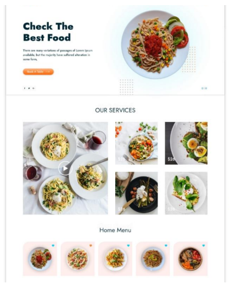
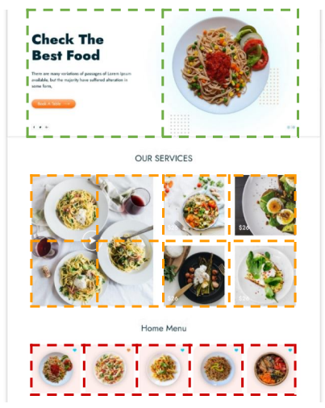
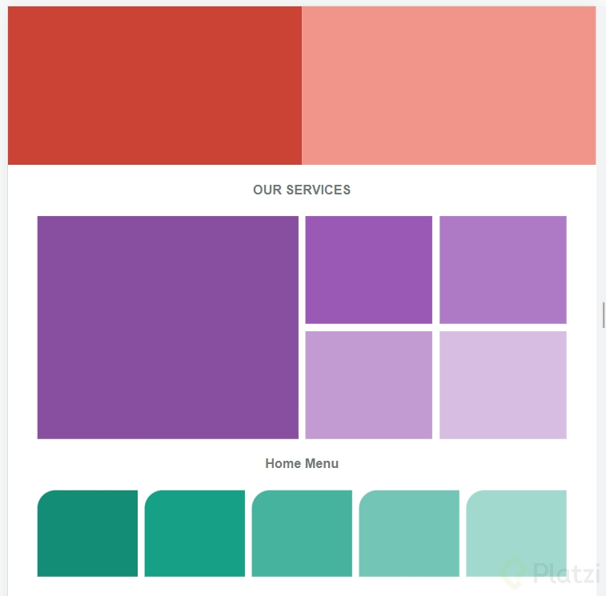

# Proyecto de Página de Comida

¡Bienvenido al proyecto de la Página de Comida! Este proyecto fue desarrollado como parte del curso de CSS Grid Básico en Platzi, para de practicar y aplicar los conocimientos adquiridos en el curso.

El objetivo principal es representar el modelo dado de la mejor manera utilizando CSS Grid, siguiendo las pautas y guías de la grilla

# Plantilla proyecto

# Grillas

